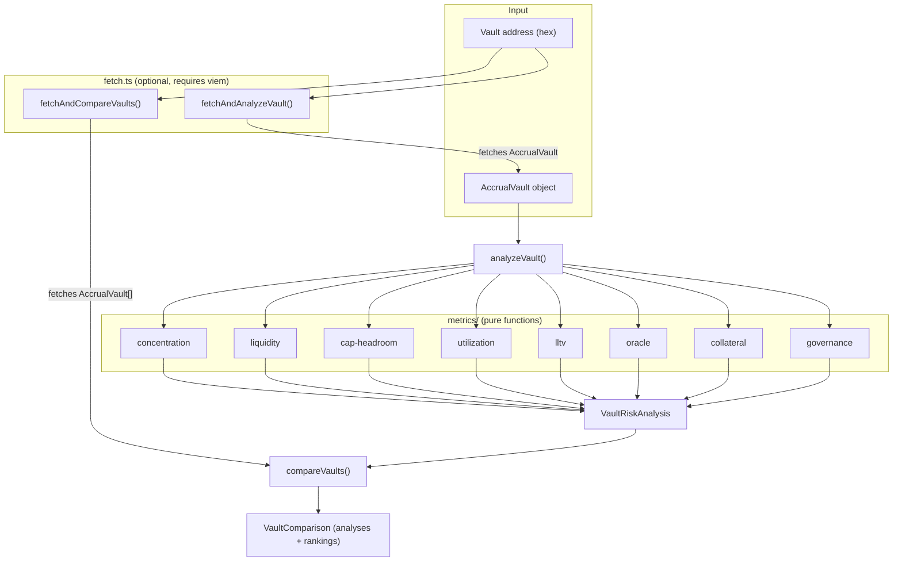

# @morpho-org/vault-risk-sdk

Quantifiable risk metrics for Morpho MetaMorpho vaults.

The existing Morpho SDKs help **interact** with vaults — this one helps **evaluate** them. It computes objective, quantifiable risk metrics from on-chain data, giving developers building blocks for risk dashboards, comparison tools, and monitoring systems without being opinionated about what's "good" or "bad."

## Quick start

```bash
pnpm install
pnpm test        # run all tests (no RPC needed)
pnpm lint        # biome check
```

### Analyze a vault from on-chain data

```ts
import { createPublicClient, http } from "viem";
import { mainnet } from "viem/chains";
import { fetchAndAnalyzeVault } from "@morpho-org/vault-risk-sdk";

const client = createPublicClient({ chain: mainnet, transport: http() });
const result = await fetchAndAnalyzeVault(
  "0xBEEF01735c132Ada46AA9aA4c54623cAA92A64CB",
  client,
);

console.log(result.concentration.hhi);          // 0-1 (0 = diversified)
console.log(result.liquidityCoverage.ratio);     // 0-1 (1 = fully liquid)
console.log(result.governance.timelockTier);     // "none" | "short" | "medium" | "long"
```

### Compare multiple vaults

```ts
import { fetchAndCompareVaults } from "@morpho-org/vault-risk-sdk";

const result = await fetchAndCompareVaults(
  ["0xBEEF...CB", "0xdd0f...0d"],
  client,
);

// Rank 1 = best (least risky) per metric
result.rankings.concentration;     // [{vault, rank}, ...]
result.rankings.liquidityCoverage;
result.rankings.lltv;
result.rankings.oracleDiversity;
result.rankings.governance;
```

### Use individual metrics selectively

```ts
import { computeConcentration, computeGovernance } from "@morpho-org/vault-risk-sdk";

const concentration = computeConcentration(vault);
const governance = computeGovernance(vault);
```

## Architecture

```
src/
├── index.ts              # Public API exports
├── types.ts              # All result types
├── errors.ts             # EmptyVaultError, ZeroTotalAssetsError, NoActiveMarketsError
├── analyze.ts            # analyzeVault() — runs all 8 metrics
├── compare.ts            # compareVaults() — multi-vault ranking
├── fetch.ts              # fetchAndAnalyzeVault/fetchAndCompareVaults (viem)
└── metrics/
    ├── concentration.ts  # HHI over allocation proportions
    ├── liquidity.ts      # Instant withdrawal coverage ratio
    ├── cap-headroom.ts   # Per-market distance to allocation cap
    ├── utilization.ts    # Weighted avg borrow utilization
    ├── lltv.ts           # LLTV range and weighted average
    ├── oracle.ts         # Oracle diversity + dominance detection
    ├── collateral.ts     # Collateral token diversity (HHI)
    └── governance.ts     # Timelock tier, guardian, curator, fee

test/
├── fixtures.ts           # Mock AccrualVault builder (no RPC)
├── integration.test.ts   # End-to-end scenarios + ranking correctness
├── analyze.test.ts       # Orchestrator tests
├── compare.test.ts       # Comparison/ranking tests
└── metrics/              # Unit tests per metric (8 files)

examples/
├── basic-analysis.ts     # Full analyzeVault walkthrough
├── compare-vaults.ts     # Multi-vault comparison
├── selective-metrics.ts  # Individual metric usage + conditional alerts
└── live-comparison.ts    # On-chain fetch against mainnet vaults
```

### Design decisions

1. **Each metric is an independent pure function** — `AccrualVault` in, typed result out. Composable, tree-shakeable, individually testable.
2. **`number` for human-readable ratios, `bigint` for WAD-scaled values** — follows Morpho SDK conventions.
3. **Comparison returns rankings, not scores** — scoring requires subjective weighting; rankings are objective.
4. **`@morpho-org/blue-sdk-viem` is optional** — the core compute layer works without viem. Only `fetch.ts` imports it.
5. **Typed errors with context** — `ZeroTotalAssetsError`, `NoActiveMarketsError`, `EmptyVaultError` all carry the vault address.

### Data flow



## Metrics reference

| Metric | What it measures | Output type | Key fields |
|--------|-----------------|-------------|------------|
| **Concentration** | Market diversification (HHI) | `ConcentrationAnalysis` | `hhi`, `activeMarketCount`, `effectiveMarketCount` |
| **Liquidity** | Instant withdrawal capacity | `LiquidityCoverageAnalysis` | `ratio` (0-1) |
| **Cap headroom** | Distance to allocation caps | `CapHeadroomAnalysis` | `tightest`, `weightedAvgUtilization` |
| **Utilization** | Weighted borrow utilization | `UtilizationExposureAnalysis` | `weightedAvg`, `max` |
| **LLTV** | Liquidation LTV distribution | `LltvAnalysis` | `min`, `max`, `weightedAvg` (WAD) |
| **Oracle** | Oracle diversity | `OracleAnalysis` | `distinctCount`, `isSingleOracleDominant` |
| **Collateral** | Collateral token diversity | `CollateralDiversityAnalysis` | `distinctCount`, `hhi` |
| **Governance** | Timelock and role assessment | `GovernanceAnalysis` | `timelockTier`, `hasGuardian`, `hasCurator` |

## Running examples

```bash
# Mock data examples (no RPC needed)
npx tsx examples/basic-analysis.ts
npx tsx examples/compare-vaults.ts
npx tsx examples/selective-metrics.ts

# Live on-chain example (requires RPC, or uses viem default)
npx tsx --env-file=.env examples/live-comparison.ts
```

## Glossary

| Term | Meaning |
|------|---------|
| **HHI** | Herfindahl-Hirschman Index — a standard measure of concentration. It sums the squared proportions of each component. HHI = 1.0 means everything is in a single bucket (maximum concentration); HHI approaching 0 means assets are spread evenly across many buckets. For example, a vault split equally across 4 markets has HHI = 4 × (0.25)² = 0.25. |
| **LLTV** | Liquidation Loan-to-Value — the maximum ratio of debt to collateral before a position becomes liquidatable. A higher LLTV means borrowers can take on more leverage, which increases risk for suppliers. An LLTV of 86% means a position is liquidated when debt exceeds 86% of collateral value. |
| **AccrualVault** | The core vault type from `@morpho-org/blue-sdk`. It represents a MetaMorpho vault with all its market allocations, positions, and accrued interest already computed. This is the input type for all metric functions in this SDK. |
| **MetaMorpho** | The Morpho vault layer — permissionlessly deployed smart contracts that allocate deposited assets across multiple Morpho Blue markets according to a curator's strategy. Each vault has its own risk profile depending on which markets it allocates to and how. |
| **Timelock** | A delay enforced before governance changes (e.g., adding markets, changing caps) take effect. Longer timelocks give depositors more time to react. This SDK categorizes timelocks into tiers: `"none"` (0s), `"short"` (<1 day), `"medium"` (<7 days), `"long"` (≥7 days). |
| **Guardian** | A vault role that can veto pending governance actions during the timelock period. A vault with a guardian set provides an additional safety check against malicious or erroneous changes. |
| **Curator** | A vault role responsible for managing market allocations and risk parameters. A vault with a curator set indicates active risk management rather than a static configuration. |
| **Cap** | The maximum amount of assets a vault is allowed to supply to a given market. Caps limit exposure to individual markets. A market at 100% cap utilization cannot receive more deposits. A cap of 0 means unlimited allocation. |
| **Utilization** | The ratio of borrowed assets to total supplied assets in a market (totalBorrowAssets / totalSupplyAssets). High utilization means most supplied assets are lent out, which reduces available liquidity for withdrawals. |

## Dependencies

| Package | Role | Required |
|---------|------|----------|
| `@morpho-org/blue-sdk` | Core vault/market types | Yes |
| `viem` | Ethereum client | Peer |
| `@morpho-org/blue-sdk-viem` | On-chain data fetching | Optional (only for `fetch.ts`) |
